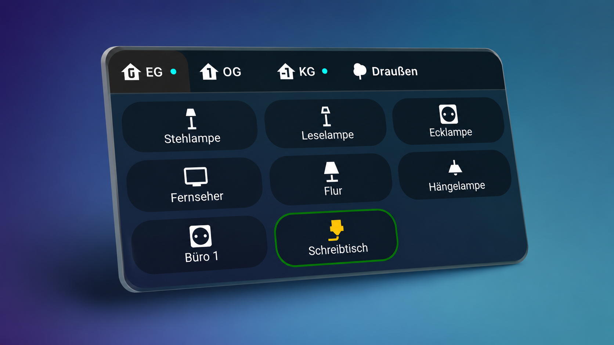

# Tabbed Stack Card


**Create clean, responsive Home Assistant dashboards with a tab experience that feels native.**



I built Tabbed Stack Card because I wanted a tab component that feels like a natural part of Home Assistant. Rather than adding another feature-rich custom card, the goal was to create an intuitive dashboard component that stays out of the way, adapts to every screen size and lets users focus on their home—not on the interface.

---

## Getting Started

A Tabbed Stack Card consists of one or more **tabs**.

Each tab acts as a container for one or multiple Home Assistant cards, allowing related information to be grouped together while keeping the dashboard compact and easy to navigate.

The card itself does not replace existing Home Assistant cards—it simply organizes them into an intuitive tabbed interface.

Most users will create and configure their tabs directly from the built-in visual editor (see below); YAML remains fully supported for advanced configurations or users who prefer manual editing.

---

## Responsive by Design

Tabbed Stack Card continuously adapts to the available width.

If all tabs fit, they are shown on a single row. If additional tabs no longer fit, they are automatically moved to the next page, and navigation controls appear only when additional pages are required. On touch devices, pages can also be changed using swipe gestures.

No configuration is required. The behaviour is completely automatic.

---

## Why Tabbed Stack Card?

Home Assistant dashboards naturally grow over time.

What often starts as a handful of cards quickly turns into long pages filled with sections, headings and endless scrolling. While tabs are an obvious way to organize content, many implementations become difficult to use once the number of tabs increases or the dashboard is viewed on a phone.

Tabbed Stack Card was created to solve exactly this problem, scaling naturally from a few tabs to large dashboards with many sections—without sacrificing clarity or usability, and with a consistent experience across desktop, tablet and smartphone.

The project is intentionally focused on usability rather than feature count.

Every feature exists for one reason:
**to make Home Assistant dashboards easier to build, easier to navigate and easier to maintain.**

---

## Design Philosophy

Every decision made during the development of this card follows two simple principles.


#### 🎨 Visual First

Configuration should happen inside Home Assistant whenever possible.

Instead of editing YAML for every little change, the built-in editor exposes nearly every available option through an intuitive graphical interface. YAML remains available whenever it is needed, but it should never be required for everyday use.


#### 🏠 Native Experience

A custom card should not feel like a foreign application inside Home Assistant.

Colors, controls and interaction patterns have been designed to blend naturally into the existing Home Assistant interface, allowing the card to feel like a native component rather than an extension.

---

## Features

| Feature | Benefit |
|----------|---------|
| 🖥️ Built-in visual editor | Configure almost everything without editing YAML |
| 📐 Responsive tab paging | No horizontal scrolling, regardless of screen size |
| 👆 Swipe navigation | Natural interaction on touch devices |
| ⚡ Lazy loading | Faster dashboard loading, especially with many cards |
| 💡 Activity indicators | Instantly identify tabs containing active devices |
| 🎨 Extensive customization | Fonts, colors, spacing and layout can be adjusted |
| 🧩 Native icon picker | Use Home Assistant's familiar icon selection |
| 📄 YAML support | Full flexibility whenever advanced configuration is required |
| 📱 Mobile optimized | Designed to work equally well on phones, tablets and desktops |
| 🚀 Lightweight | No external dependencies required |

---

## Overview

### Dashboard


A realistic Home Assistant dashboard showing:

- Freely configurable number of tabs
- several different card types
- activity indicators

> Please note: Tabbed Stack Card is designed to integrate seamlessly with Home Assistant's native [lovelace-card-mod](https://github.com/thomasloven/lovelace-card-mod) styling. Consequently, buttons used inside a Tabbed Stack Card are not automatically outlined with a colored border when turned on.

---

### Visual Editor

Tabbed Stack Card has been designed around its visual editor: nearly every aspect of the card can be configured directly inside Home Assistant, in a workflow that is intuitive, responsive and familiar to Home Assistant users


Display the complete editor including:

- General appearance settings
- Active tab settings
- Activity indicator settings
- Multiple configured tabs
- Font size
- Minimum tab width
- Horizontal spacing
- Text color
- Active tab color
- Background color
- Transparency

Changes are applied immediately, making it easy to experiment with different styles. Full YAML editing remains available whenever manual configuration is preferred.

---

### Individual Tab Configuration


Every tab can be configured independently.

Each tab supports:

- Custom title
- Home Assistant icon picker
- **Enable / disable switch for each tab**
- Individual card configuration
- YAML editor

Disabled tabs remain part of the configuration and can easily be re-enabled later.

---

### Activity Indicators


Activity indicators allow important information to remain visible even when another tab is currently selected.

When supported entities become active, a colored indicator can automatically appear next to the corresponding tab. Optionally, the tab title and icon can also change color to provide additional visual feedback.

Supported domains currently include:

- `light`
- `switch`
- `fan`
- `cover`
- `climate`
- `humidifier`
- `input_boolean`

This makes it easy to identify active rooms or devices at a glance without opening every tab.

---

## Responsive Navigation

Responsive navigation is the defining feature of Tabbed Stack Card (see [Responsive by Design](#responsive-by-design) above): instead of shrinking tabs until they become unreadable or introducing horizontal scrolling, the card automatically calculates how many tabs fit into the available width and moves the rest onto separate pages, with navigation controls appearing only when actually required.

---

## Lazy Loading

Large dashboards can contain dozens of cards. Creating every card immediately would increase loading times and consume unnecessary resources.

Tabbed Stack Card therefore loads only the currently visible tab during the initial render. Additional tabs are created automatically when they are opened for the first time and remain available afterwards.

This approach improves dashboard responsiveness while remaining completely transparent to the user.

---

## Installation

### HACS

[](https://my.home-assistant.io/redirect/hacs_repository/?owner=Swiftrail84&repository=tabbed-stack-card&category=plugin)

Install using HACS or [see this guide](https://www.hacs.xyz/docs/use/configuration/basic/#to-set-up-the-hacs-integration).

Search for **Tabbed Stack Card** inside HACS and install the card.

Restart Home Assistant if required.

The dashboard resource will usually be added automatically.

---

### Manual Installation

Copy

```
tabbed-stack-card.js
```

to

```
/config/www/
```

Add the following dashboard resource:

```yaml
url: /local/tabbed-stack-card.js
type: module
```

Restart Home Assistant.

---

## Basic Configuration

The simplest configuration consists of two tabs containing standard Home Assistant cards.

```yaml
type: custom:tabbed-stack-card
tabs:
  - label: Living Room
    icon: mdi:sofa
    cards:
      - type: entities
        entities:
          - light.living_room
          - switch.tv

  - label: Climate
    icon: mdi:thermometer
    cards:
      - type: thermostat
        entity: climate.house
```

---

## Multiple Cards per Tab

Tabs are not limited to a single card.

Each tab can contain any number of Home Assistant cards, making it possible to group complete dashboard sections behind a single tab.

```yaml
type: custom:tabbed-stack-card
tabs:
  - label: Home
    icon: mdi:home

    cards:
      - type: entities
        entities:
          - light.kitchen
          - light.dining_room
          - switch.coffee_machine

      - type: glance
        entities:
          - binary_sensor.front_door
          - binary_sensor.garage

      - type: weather-forecast
        entity: weather.home
```

---

# Acknowledgements

Developing a polished Home Assistant custom card requires countless hours of design, experimentation and refinement.

This project also benefited from extensive AI-assisted development using **ChatGPT** and **Claude**, which provided valuable support during brainstorming, debugging and implementation.

Every feature, design decision and final implementation has been reviewed and adapted manually.

**Thanks to [Tabbed Card](https://github.com/kinghat/tabbed-card) for the inspiration! And finally, in the words of [kinghat](https://github.com/kinghat): a huge thank you to [Home Assistant](https://www.home-assistant.io/) and [HACS](https://hacs.xyz/) for providing such an incredible platform and ecosystem for the community.**

---

## Compatibility

- Home Assistant 2025.1+
- Lovelace Dashboards
- HACS
- Manual installation supported
- No external dependencies

---

# License

This project is licensed under the [MIT License](LICENSE).
